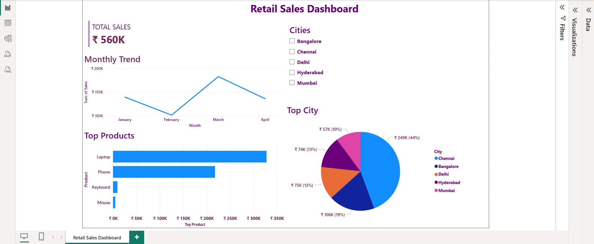

# Retail Sales Analysis Dashboard

## Overview
Interactive dashboard built using SQL, Power BI, Python and Streamlit.

## Features
- Data Cleaning
- SQL Analysis
- Sales KPIs
- Monthly Trends
- Top Products
- City Filters
- Interactive Dashboard

## Tools
- Python
- Pandas
- SQLite
- Power BI
- Streamlit

## Dashboard Metrics
- Total Sales
- Top Products
- Monthly Trends
- City Performance

## Deployment
Streamlit App

## Dashboard Preview

